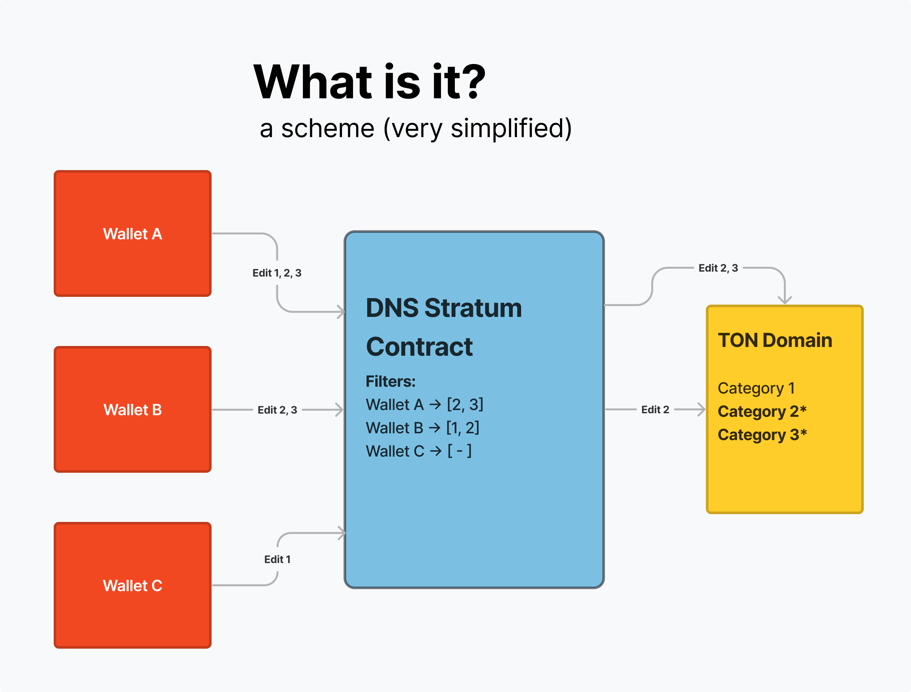
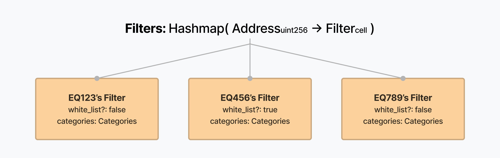
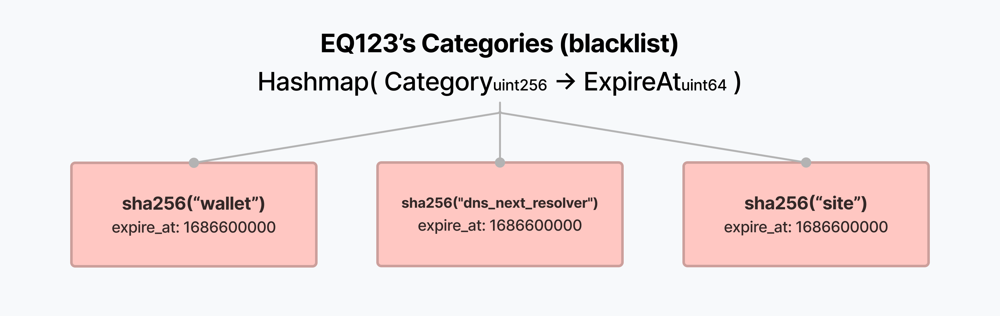
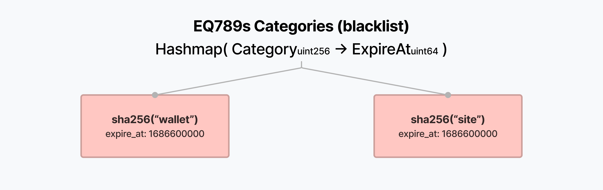

# TON DNS Pack Contract

Pack Contract is a layer between users and a domain, allowing users
to manage records in the domain by sending messages with the body of the
corresponding format not directly to the domain, but to the layer that
filters the editing of certain records and forwards messages to the
domain.

# How filters work
There is a root filters dictionary, where address hashpart points to a
Filter for this address.

in Filter we have `white_list?` boolean and another hashmap with
categories of this whitelist or blacklist.

Keys or categories in TON DNS are consist of 256 bits. Categories hashmap
links every whitelisted/blacklisted key to it's expiration timestamp.
After passing this timestamp, editor can't edit (if it whitelist) or 
can edit (if it blacklist) this record.

Corresponding to this pictures, if **EQ123** will try to edit record
`sha256("wallet")` or `sha256("dns_next_resolver")` or `sha256("site")`
before the 1686600000 second from 1970, it'll fail with exit code 502.
But **EQ123** can easily change other records, for example `sha256("bag")`.
And after passing 1686600000 timestamp **EQ123** will be able to edit any
record in the domain (before the whole pack contract expiration).

**EQ456** has in his whitelist only ability to change category
`sha256("dns_next_resolver")` before time 1686600000. If he will try to
edit other categories at any time (no matter after or before the timestamp),
it'll fail.

**EQ789** can edit any record except `sha256("wallet")` and `sha256("site")`
before the 1686600000. And he can edit **all the records** after this time.
